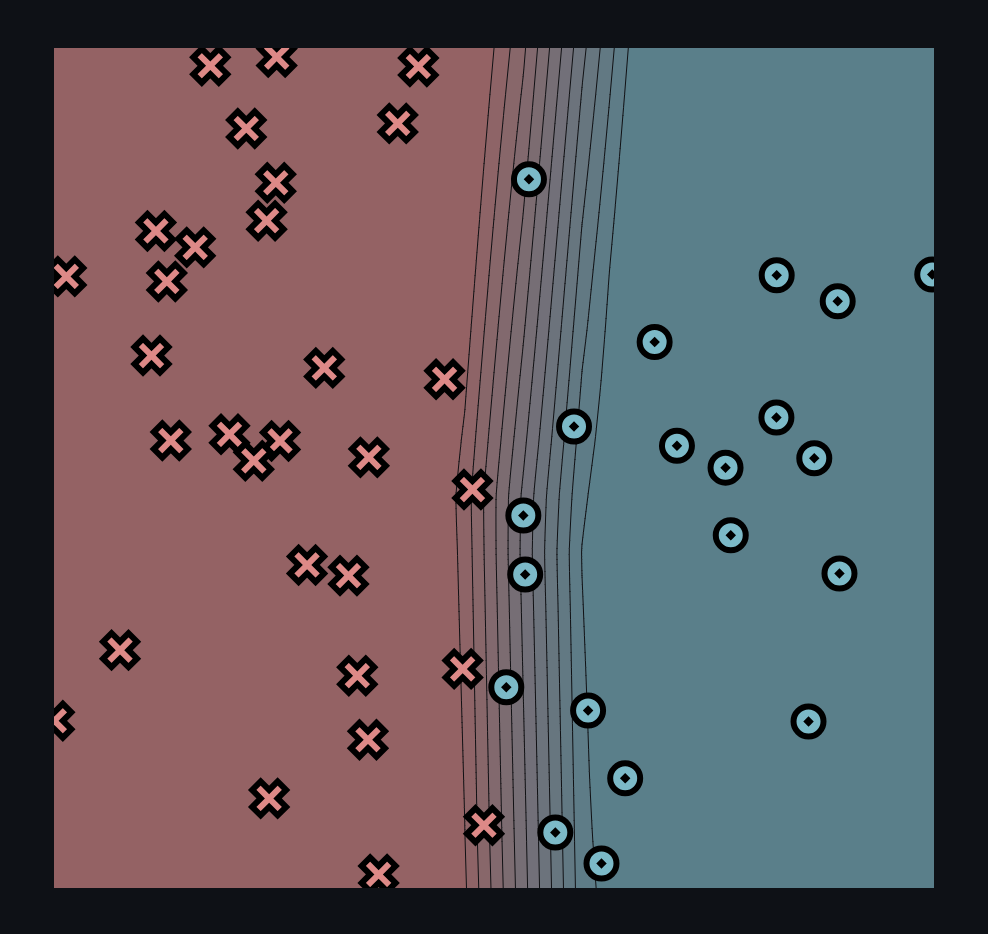
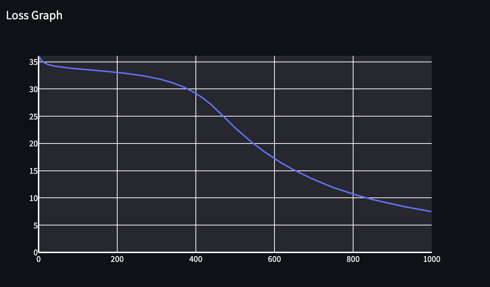
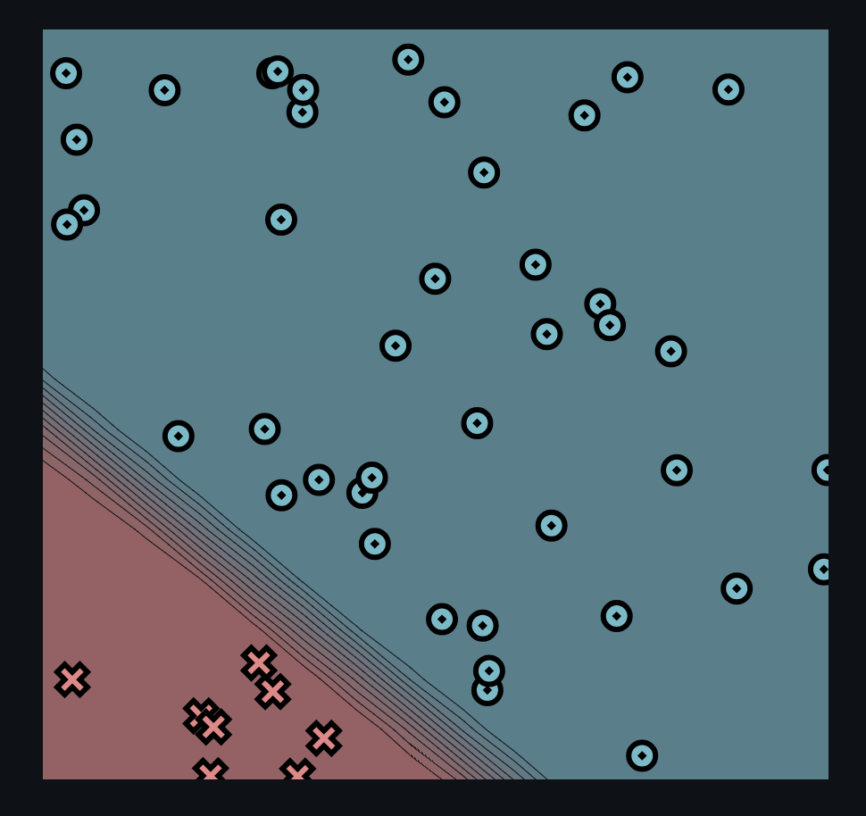
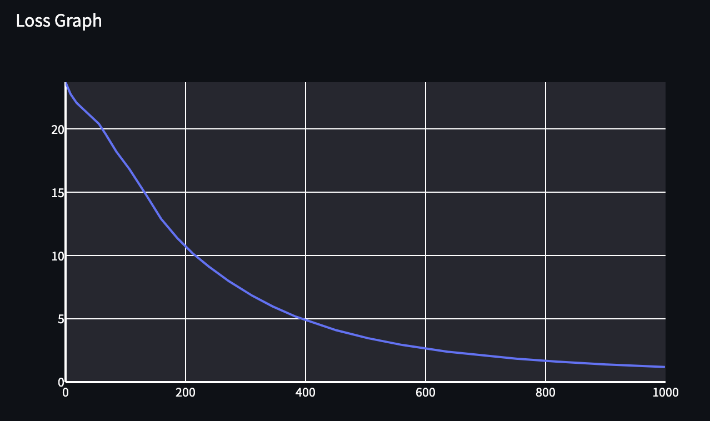
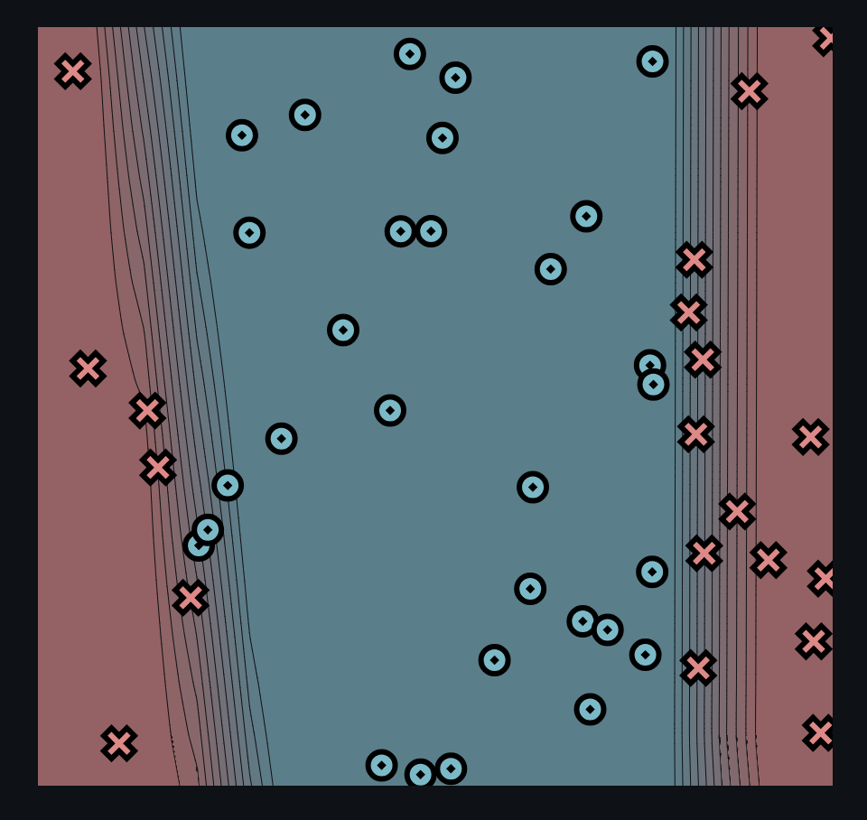
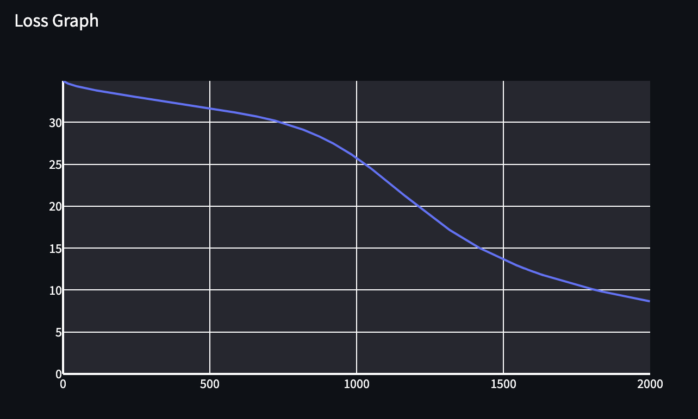
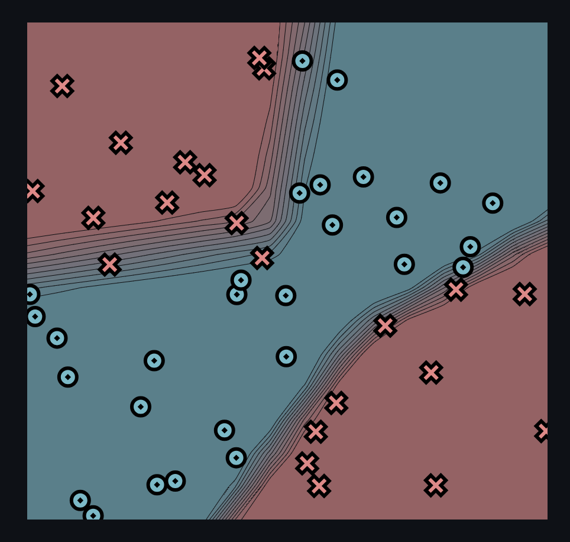
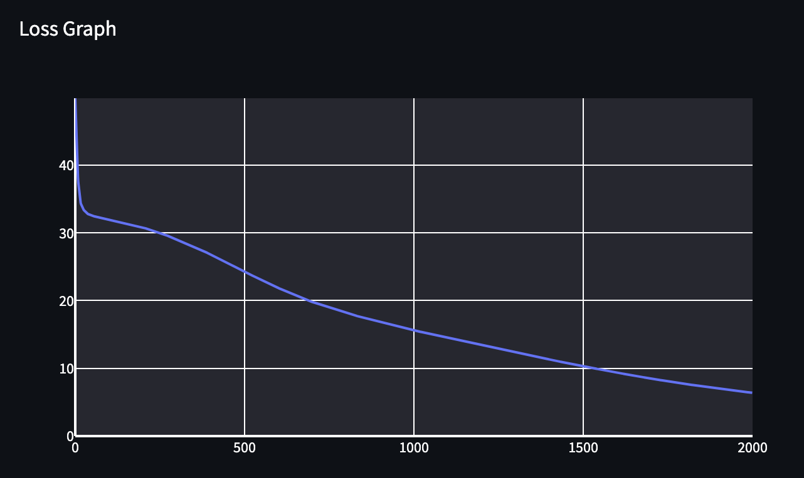

[](https://classroom.github.com/a/YFgwt0yY)
# MiniTorch Module 2


* Docs: https://minitorch.github.io/

* Overview: https://minitorch.github.io/module2/module2/

This assignment requires the following files from the previous assignments. You can get these by running

```bash
python sync_previous_module.py previous-module-dir current-module-dir
```

The files that will be synced are:

        minitorch/operators.py minitorch/module.py minitorch/autodiff.py minitorch/scalar.py minitorch/scalar_functions.py minitorch/module.py project/run_manual.py project/run_scalar.py project/datasets.py

**Task 2.5**

**Simple (Hidden Layers: 2, Learning Rate: 0.05, Epochs: 1000)**

Time per Epoch: 0.079s





Epoch: 10/1000, loss: 35.15511007074789, correct: 30
Epoch: 20/1000, loss: 34.653797307279376, correct: 30
Epoch: 30/1000, loss: 34.39579415562271, correct: 30
Epoch: 40/1000, loss: 34.22493117733139, correct: 30
Epoch: 50/1000, loss: 34.11912179544528, correct: 30
Epoch: 60/1000, loss: 34.03029522625467, correct: 30
Epoch: 70/1000, loss: 33.94067799541111, correct: 30
Epoch: 80/1000, loss: 33.84695967386965, correct: 30
Epoch: 90/1000, loss: 33.76629151931024, correct: 30
Epoch: 100/1000, loss: 33.69739537599235, correct: 30
Epoch: 110/1000, loss: 33.638806528055504, correct: 30
Epoch: 120/1000, loss: 33.57754921908407, correct: 30
Epoch: 130/1000, loss: 33.51805852490795, correct: 30
Epoch: 140/1000, loss: 33.45921203872892, correct: 30
Epoch: 150/1000, loss: 33.40179356415899, correct: 30
Epoch: 160/1000, loss: 33.34277987996179, correct: 30
Epoch: 170/1000, loss: 33.28023833895553, correct: 30
Epoch: 180/1000, loss: 33.2144337058279, correct: 30
Epoch: 190/1000, loss: 33.14685199113178, correct: 30
Epoch: 200/1000, loss: 33.073835141922665, correct: 30
Epoch: 210/1000, loss: 32.995181779998454, correct: 30
Epoch: 220/1000, loss: 32.91005433626755, correct: 30
Epoch: 230/1000, loss: 32.823979385058564, correct: 30
Epoch: 240/1000, loss: 32.72822696847013, correct: 30
Epoch: 250/1000, loss: 32.62261094284673, correct: 30
Epoch: 260/1000, loss: 32.513873697102, correct: 30
Epoch: 270/1000, loss: 32.39707207540055, correct: 30
Epoch: 280/1000, loss: 32.268898238968724, correct: 30
Epoch: 290/1000, loss: 32.13108126197121, correct: 30
Epoch: 300/1000, loss: 31.979353766925595, correct: 30
Epoch: 310/1000, loss: 31.811753834960804, correct: 30
Epoch: 320/1000, loss: 31.626132860510726, correct: 30
Epoch: 330/1000, loss: 31.42117516092937, correct: 30
Epoch: 340/1000, loss: 31.194432235197446, correct: 30
Epoch: 350/1000, loss: 30.943468007053333, correct: 30
Epoch: 360/1000, loss: 30.669325332996937, correct: 30
Epoch: 370/1000, loss: 30.36318970638066, correct: 30
Epoch: 380/1000, loss: 30.02622579536104, correct: 30
Epoch: 390/1000, loss: 29.65402497835523, correct: 30
Epoch: 400/1000, loss: 29.242278681126816, correct: 30
Epoch: 410/1000, loss: 28.78787838906252, correct: 30
Epoch: 420/1000, loss: 28.28695918941964, correct: 30
Epoch: 430/1000, loss: 27.73581209863002, correct: 30
Epoch: 440/1000, loss: 27.13321034284067, correct: 30
Epoch: 450/1000, loss: 26.484605026488513, correct: 30
Epoch: 460/1000, loss: 25.78852007391291, correct: 37
Epoch: 470/1000, loss: 25.048700240769694, correct: 38
Epoch: 480/1000, loss: 24.302291220617207, correct: 40
Epoch: 490/1000, loss: 23.609103673764718, correct: 40
Epoch: 500/1000, loss: 22.9329459317562, correct: 41
Epoch: 510/1000, loss: 22.277136324418205, correct: 42
Epoch: 520/1000, loss: 21.64134965461657, correct: 43
Epoch: 530/1000, loss: 21.019072880962756, correct: 43
Epoch: 540/1000, loss: 20.422000841700726, correct: 44
Epoch: 550/1000, loss: 19.837271847202068, correct: 44
Epoch: 560/1000, loss: 19.283801478867407, correct: 44
Epoch: 570/1000, loss: 18.758428756598153, correct: 44
Epoch: 580/1000, loss: 18.247483684797224, correct: 45
Epoch: 590/1000, loss: 17.751034712492896, correct: 45
Epoch: 600/1000, loss: 17.272913129778324, correct: 45
Epoch: 610/1000, loss: 16.80884875216202, correct: 45
Epoch: 620/1000, loss: 16.359551660638363, correct: 45
Epoch: 630/1000, loss: 15.93894299910655, correct: 45
Epoch: 640/1000, loss: 15.542714053503607, correct: 46
Epoch: 650/1000, loss: 15.159520586959918, correct: 46
Epoch: 660/1000, loss: 14.78698677670591, correct: 47
Epoch: 670/1000, loss: 14.426535079550918, correct: 48
Epoch: 680/1000, loss: 14.079050256160311, correct: 48
Epoch: 690/1000, loss: 13.74429612521384, correct: 48
Epoch: 700/1000, loss: 13.420322599753606, correct: 48
Epoch: 710/1000, loss: 13.107069976305635, correct: 48
Epoch: 720/1000, loss: 12.80171095083734, correct: 48
Epoch: 730/1000, loss: 12.50493154345729, correct: 48
Epoch: 740/1000, loss: 12.211127654165507, correct: 49
Epoch: 750/1000, loss: 11.925812203663973, correct: 49
Epoch: 760/1000, loss: 11.664204185717189, correct: 49
Epoch: 770/1000, loss: 11.416485033206905, correct: 49
Epoch: 780/1000, loss: 11.17650050052762, correct: 49
Epoch: 790/1000, loss: 10.944970828059763, correct: 49
Epoch: 800/1000, loss: 10.720284818833266, correct: 49
Epoch: 810/1000, loss: 10.503903166445383, correct: 49
Epoch: 820/1000, loss: 10.297611657464074, correct: 49
Epoch: 830/1000, loss: 10.100768403079975, correct: 49
Epoch: 840/1000, loss: 9.909476976860093, correct: 49
Epoch: 850/1000, loss: 9.724407670479083, correct: 49
Epoch: 860/1000, loss: 9.54286961126285, correct: 49
Epoch: 870/1000, loss: 9.36712214895802, correct: 49
Epoch: 880/1000, loss: 9.196727200745183, correct: 49
Epoch: 890/1000, loss: 9.031973110155207, correct: 49
Epoch: 900/1000, loss: 8.87257962025133, correct: 49
Epoch: 910/1000, loss: 8.716903945860693, correct: 49
Epoch: 920/1000, loss: 8.565608272147085, correct: 49
Epoch: 930/1000, loss: 8.418966810929202, correct: 49
Epoch: 940/1000, loss: 8.277122682242846, correct: 49
Epoch: 950/1000, loss: 8.139630497817851, correct: 49
Epoch: 960/1000, loss: 8.006171973823884, correct: 49
Epoch: 970/1000, loss: 7.876683342172351, correct: 50
Epoch: 980/1000, loss: 7.7513826341415095, correct: 50
Epoch: 990/1000, loss: 7.630039176528977, correct: 50
Epoch: 1000/1000, loss: 7.512441169991, correct: 50

**Diag (Hidden Layers: 2, Learning Rate: 0.1, Epochs: 1000)**

Time per Epoch: 0.083s





Epoch: 10/1000, loss: 22.711307161829147, correct: 42
Epoch: 20/1000, loss: 22.03972093092095, correct: 42
Epoch: 30/1000, loss: 21.58194940655377, correct: 42
Epoch: 40/1000, loss: 21.172235338350635, correct: 42
Epoch: 50/1000, loss: 20.75941086619448, correct: 42
Epoch: 60/1000, loss: 20.18304961314095, correct: 42
Epoch: 70/1000, loss: 19.424989848078955, correct: 42
Epoch: 80/1000, loss: 18.561289624147843, correct: 42
Epoch: 90/1000, loss: 17.95319894214051, correct: 42
Epoch: 100/1000, loss: 17.328264336638245, correct: 42
Epoch: 110/1000, loss: 16.64992344178231, correct: 42
Epoch: 120/1000, loss: 15.957192390997225, correct: 42
Epoch: 130/1000, loss: 15.21470747375538, correct: 42
Epoch: 140/1000, loss: 14.426229772861586, correct: 42
Epoch: 150/1000, loss: 13.610413390053408, correct: 42
Epoch: 160/1000, loss: 12.919032824190959, correct: 42
Epoch: 170/1000, loss: 12.316109956720034, correct: 42
Epoch: 180/1000, loss: 11.75837244081342, correct: 42
Epoch: 190/1000, loss: 11.242625070496418, correct: 42
Epoch: 200/1000, loss: 10.747171074999075, correct: 42
Epoch: 210/1000, loss: 10.298988860891553, correct: 42
Epoch: 220/1000, loss: 9.886077464587826, correct: 42
Epoch: 230/1000, loss: 9.496310004466165, correct: 42
Epoch: 240/1000, loss: 9.122051566747436, correct: 42
Epoch: 250/1000, loss: 8.762045875429584, correct: 42
Epoch: 260/1000, loss: 8.416107665366496, correct: 42
Epoch: 270/1000, loss: 8.084106089209117, correct: 42
Epoch: 280/1000, loss: 7.765831279296647, correct: 42
Epoch: 290/1000, loss: 7.460994714227025, correct: 47
Epoch: 300/1000, loss: 7.169246267079455, correct: 47
Epoch: 310/1000, loss: 6.890191261729208, correct: 48
Epoch: 320/1000, loss: 6.623405333799385, correct: 48
Epoch: 330/1000, loss: 6.368446770586615, correct: 49
Epoch: 340/1000, loss: 6.124866334021883, correct: 49
Epoch: 350/1000, loss: 5.892214739273391, correct: 49
Epoch: 360/1000, loss: 5.671103813581511, correct: 50
Epoch: 370/1000, loss: 5.462496818559971, correct: 50
Epoch: 380/1000, loss: 5.263863384840885, correct: 50
Epoch: 390/1000, loss: 5.075160936149553, correct: 50
Epoch: 400/1000, loss: 4.899160226012411, correct: 50
Epoch: 410/1000, loss: 4.727788086574759, correct: 50
Epoch: 420/1000, loss: 4.56686501838148, correct: 50
Epoch: 430/1000, loss: 4.415238064613455, correct: 50
Epoch: 440/1000, loss: 4.2695182336670205, correct: 50
Epoch: 450/1000, loss: 4.128990358829611, correct: 50
Epoch: 460/1000, loss: 3.996801679593188, correct: 50
Epoch: 470/1000, loss: 3.869877110229038, correct: 50
Epoch: 480/1000, loss: 3.7493062636168095, correct: 50
Epoch: 490/1000, loss: 3.6341807921534586, correct: 50
Epoch: 500/1000, loss: 3.5242643362067327, correct: 50
Epoch: 510/1000, loss: 3.4190486952612766, correct: 50
Epoch: 520/1000, loss: 3.3182889633627193, correct: 50
Epoch: 530/1000, loss: 3.2217679493279245, correct: 50
Epoch: 540/1000, loss: 3.1292807098376896, correct: 50
Epoch: 550/1000, loss: 3.0406329665245573, correct: 50
Epoch: 560/1000, loss: 2.9556404379131043, correct: 50
Epoch: 570/1000, loss: 2.874128256345654, correct: 50
Epoch: 580/1000, loss: 2.7959304389886266, correct: 50
Epoch: 590/1000, loss: 2.7208894002690376, correct: 50
Epoch: 600/1000, loss: 2.6488554987672046, correct: 50
Epoch: 610/1000, loss: 2.57968660946067, correct: 50
Epoch: 620/1000, loss: 2.5132477417020875, correct: 50
Epoch: 630/1000, loss: 2.4497613243275134, correct: 50
Epoch: 640/1000, loss: 2.388842803084173, correct: 50
Epoch: 650/1000, loss: 2.3304646312374557, correct: 50
Epoch: 660/1000, loss: 2.2744450110024834, correct: 50
Epoch: 670/1000, loss: 2.2216005093518922, correct: 50
Epoch: 680/1000, loss: 2.168962040971111, correct: 50
Epoch: 690/1000, loss: 2.1194593652862617, correct: 50
Epoch: 700/1000, loss: 2.0724123586029966, correct: 50
Epoch: 710/1000, loss: 2.0255667856997666, correct: 50
Epoch: 720/1000, loss: 1.9812905164688004, correct: 50
Epoch: 730/1000, loss: 1.9387069786407645, correct: 50
Epoch: 740/1000, loss: 1.898773651828581, correct: 50
Epoch: 750/1000, loss: 1.8583049783285783, correct: 50
Epoch: 760/1000, loss: 1.8201579507641938, correct: 50
Epoch: 770/1000, loss: 1.7836907294259168, correct: 50
Epoch: 780/1000, loss: 1.7485608475526355, correct: 50
Epoch: 790/1000, loss: 1.7131572072443506, correct: 50
Epoch: 800/1000, loss: 1.6804413540640604, correct: 50
Epoch: 810/1000, loss: 1.6486822507332655, correct: 50
Epoch: 820/1000, loss: 1.6174070841778825, correct: 50
Epoch: 830/1000, loss: 1.5870525731656073, correct: 50
Epoch: 840/1000, loss: 1.5586728661417877, correct: 50
Epoch: 850/1000, loss: 1.5304029070988021, correct: 50
Epoch: 860/1000, loss: 1.5028934517695907, correct: 50
Epoch: 870/1000, loss: 1.476493412799448, correct: 50
Epoch: 880/1000, loss: 1.4511722111077385, correct: 50
Epoch: 890/1000, loss: 1.4262247578464593, correct: 50
Epoch: 900/1000, loss: 1.402091782866389, correct: 50
Epoch: 910/1000, loss: 1.3784606072946675, correct: 50
Epoch: 920/1000, loss: 1.3561800651645288, correct: 50
Epoch: 930/1000, loss: 1.3341806541110295, correct: 50
Epoch: 940/1000, loss: 1.3125242622347741, correct: 50
Epoch: 950/1000, loss: 1.2917999120361312, correct: 50
Epoch: 960/1000, loss: 1.271825352021633, correct: 50
Epoch: 970/1000, loss: 1.2519831809443165, correct: 50
Epoch: 980/1000, loss: 1.233201284604063, correct: 50
Epoch: 990/1000, loss: 1.2144864464833074, correct: 50
Epoch: 1000/1000, loss: 1.1963736793768625, correct: 50

**Split (Hidden Layers: 5, Learning Rate: 0.05, Epochs: 2000)**

Time per Epoch: 0.157s





Epoch: 10/2000, loss: 34.74534345569984, correct: 31
Epoch: 20/2000, loss: 34.58638789425613, correct: 31
Epoch: 30/2000, loss: 34.469367397919314, correct: 30
Epoch: 40/2000, loss: 34.36722849912997, correct: 30
Epoch: 50/2000, loss: 34.2736953932241, correct: 30
Epoch: 60/2000, loss: 34.190543983020994, correct: 30
Epoch: 70/2000, loss: 34.1117590655488, correct: 30
Epoch: 80/2000, loss: 34.03634879327811, correct: 30
Epoch: 90/2000, loss: 33.96379681731701, correct: 30
Epoch: 100/2000, loss: 33.893640576009965, correct: 30
Epoch: 110/2000, loss: 33.82553161102364, correct: 30
Epoch: 120/2000, loss: 33.75919585146653, correct: 30
Epoch: 130/2000, loss: 33.696277746502965, correct: 30
Epoch: 140/2000, loss: 33.63487711958172, correct: 30
Epoch: 150/2000, loss: 33.574714918953894, correct: 30
Epoch: 160/2000, loss: 33.51562194467371, correct: 30
Epoch: 170/2000, loss: 33.4576603345973, correct: 30
Epoch: 180/2000, loss: 33.40035326380341, correct: 30
Epoch: 190/2000, loss: 33.343500747322004, correct: 30
Epoch: 200/2000, loss: 33.28691560738398, correct: 30
Epoch: 210/2000, loss: 33.23119450302206, correct: 30
Epoch: 220/2000, loss: 33.17681204656237, correct: 30
Epoch: 230/2000, loss: 33.12266177016315, correct: 30
Epoch: 240/2000, loss: 33.06827478546183, correct: 30
Epoch: 250/2000, loss: 33.013600294321535, correct: 30
Epoch: 260/2000, loss: 32.95839787590803, correct: 30
Epoch: 270/2000, loss: 32.90381498106308, correct: 30
Epoch: 280/2000, loss: 32.848869348972464, correct: 30
Epoch: 290/2000, loss: 32.793974010823696, correct: 30
Epoch: 300/2000, loss: 32.73906443308453, correct: 30
Epoch: 310/2000, loss: 32.68464544504444, correct: 30
Epoch: 320/2000, loss: 32.62998092065904, correct: 30
Epoch: 330/2000, loss: 32.57506286274085, correct: 30
Epoch: 340/2000, loss: 32.52012193155168, correct: 30
Epoch: 350/2000, loss: 32.46712207198018, correct: 30
Epoch: 360/2000, loss: 32.41383619096723, correct: 30
Epoch: 370/2000, loss: 32.36060578001873, correct: 30
Epoch: 380/2000, loss: 32.30759525081278, correct: 30
Epoch: 390/2000, loss: 32.25407274678634, correct: 30
Epoch: 400/2000, loss: 32.20083800979465, correct: 30
Epoch: 410/2000, loss: 32.14739256766575, correct: 30
Epoch: 420/2000, loss: 32.09371951975926, correct: 30
Epoch: 430/2000, loss: 32.04010792128134, correct: 31
Epoch: 440/2000, loss: 31.986602308025883, correct: 31
Epoch: 450/2000, loss: 31.932731963417776, correct: 31
Epoch: 460/2000, loss: 31.878339017997156, correct: 31
Epoch: 470/2000, loss: 31.82382643497986, correct: 32
Epoch: 480/2000, loss: 31.769070285850546, correct: 32
Epoch: 490/2000, loss: 31.713881553135543, correct: 33
Epoch: 500/2000, loss: 31.659022781537654, correct: 33
Epoch: 510/2000, loss: 31.603577685004446, correct: 33
Epoch: 520/2000, loss: 31.548410444903215, correct: 33
Epoch: 530/2000, loss: 31.492672540412414, correct: 33
Epoch: 540/2000, loss: 31.43612940858277, correct: 33
Epoch: 550/2000, loss: 31.379902616661973, correct: 34
Epoch: 560/2000, loss: 31.32355206512149, correct: 34
Epoch: 570/2000, loss: 31.2663903968536, correct: 35
Epoch: 580/2000, loss: 31.20783014365422, correct: 36
Epoch: 590/2000, loss: 31.147929977360636, correct: 36
Epoch: 600/2000, loss: 31.087120972129735, correct: 36
Epoch: 610/2000, loss: 31.026163391857015, correct: 36
Epoch: 620/2000, loss: 30.96395818588516, correct: 36
Epoch: 630/2000, loss: 30.900094040294526, correct: 36
Epoch: 640/2000, loss: 30.83393916908298, correct: 36
Epoch: 650/2000, loss: 30.766835922207804, correct: 36
Epoch: 660/2000, loss: 30.697969066944612, correct: 37
Epoch: 670/2000, loss: 30.626392783986283, correct: 37
Epoch: 680/2000, loss: 30.5519621016585, correct: 37
Epoch: 690/2000, loss: 30.47453079029346, correct: 37
Epoch: 700/2000, loss: 30.393876442959677, correct: 37
Epoch: 710/2000, loss: 30.3090642892658, correct: 37
Epoch: 720/2000, loss: 30.220206170929245, correct: 38
Epoch: 730/2000, loss: 30.12696918330541, correct: 38
Epoch: 740/2000, loss: 30.030798099720325, correct: 38
Epoch: 750/2000, loss: 29.930594048511285, correct: 38
Epoch: 760/2000, loss: 29.825878929965366, correct: 38
Epoch: 770/2000, loss: 29.71618914634208, correct: 38
Epoch: 780/2000, loss: 29.601851791876477, correct: 38
Epoch: 790/2000, loss: 29.48384012543385, correct: 38
Epoch: 800/2000, loss: 29.36347487534872, correct: 38
Epoch: 810/2000, loss: 29.23834289776472, correct: 38
Epoch: 820/2000, loss: 29.10806880104187, correct: 38
Epoch: 830/2000, loss: 28.972059029236735, correct: 39
Epoch: 840/2000, loss: 28.83006333407729, correct: 39
Epoch: 850/2000, loss: 28.682642800246516, correct: 39
Epoch: 860/2000, loss: 28.530637769180178, correct: 39
Epoch: 870/2000, loss: 28.373216700558963, correct: 39
Epoch: 880/2000, loss: 28.210556826964417, correct: 39
Epoch: 890/2000, loss: 28.04201700161322, correct: 39
Epoch: 900/2000, loss: 27.86684755045057, correct: 39
Epoch: 910/2000, loss: 27.68653503820243, correct: 39
Epoch: 920/2000, loss: 27.500568528470055, correct: 39
Epoch: 930/2000, loss: 27.306876654514443, correct: 39
Epoch: 940/2000, loss: 27.108685143131364, correct: 39
Epoch: 950/2000, loss: 26.901663062427644, correct: 39
Epoch: 960/2000, loss: 26.689506234484654, correct: 39
Epoch: 970/2000, loss: 26.470659374059203, correct: 39
Epoch: 980/2000, loss: 26.245009671170884, correct: 39
Epoch: 990/2000, loss: 26.01134117921342, correct: 39
Epoch: 1000/2000, loss: 25.77409775170016, correct: 39
Epoch: 1010/2000, loss: 25.53026910672425, correct: 39
Epoch: 1020/2000, loss: 25.281003756883457, correct: 39
Epoch: 1030/2000, loss: 25.025924045805233, correct: 40
Epoch: 1040/2000, loss: 24.76495238900788, correct: 40
Epoch: 1050/2000, loss: 24.498902773837678, correct: 40
Epoch: 1060/2000, loss: 24.227667854720504, correct: 40
Epoch: 1070/2000, loss: 23.953856791189455, correct: 41
Epoch: 1080/2000, loss: 23.674905395722597, correct: 41
Epoch: 1090/2000, loss: 23.394242943914605, correct: 41
Epoch: 1100/2000, loss: 23.112447686814566, correct: 42
Epoch: 1110/2000, loss: 22.82688307664219, correct: 42
Epoch: 1120/2000, loss: 22.540481160455553, correct: 42
Epoch: 1130/2000, loss: 22.252053798489086, correct: 43
Epoch: 1140/2000, loss: 21.965095121504444, correct: 43
Epoch: 1150/2000, loss: 21.679466618722145, correct: 43
Epoch: 1160/2000, loss: 21.39761350182749, correct: 44
Epoch: 1170/2000, loss: 21.11259047191879, correct: 44
Epoch: 1180/2000, loss: 20.830098859382115, correct: 44
Epoch: 1190/2000, loss: 20.548498394593032, correct: 45
Epoch: 1200/2000, loss: 20.267842315227227, correct: 45
Epoch: 1210/2000, loss: 19.988671239878197, correct: 45
Epoch: 1220/2000, loss: 19.710392678468295, correct: 45
Epoch: 1230/2000, loss: 19.43423215758894, correct: 46
Epoch: 1240/2000, loss: 19.161064408285377, correct: 46
Epoch: 1250/2000, loss: 18.88819135462548, correct: 47
Epoch: 1260/2000, loss: 18.620777547390468, correct: 47
Epoch: 1270/2000, loss: 18.35615028355125, correct: 48
Epoch: 1280/2000, loss: 18.099232080007155, correct: 48
Epoch: 1290/2000, loss: 17.84635935153302, correct: 48
Epoch: 1300/2000, loss: 17.60155425044355, correct: 47
Epoch: 1310/2000, loss: 17.35448225697417, correct: 48
Epoch: 1320/2000, loss: 17.118399956202303, correct: 48
Epoch: 1330/2000, loss: 16.88702338409236, correct: 48
Epoch: 1340/2000, loss: 16.656686597152234, correct: 48
Epoch: 1350/2000, loss: 16.43339286849563, correct: 49
Epoch: 1360/2000, loss: 16.213612259003128, correct: 49
Epoch: 1370/2000, loss: 15.999513197520205, correct: 49
Epoch: 1380/2000, loss: 15.788617723822174, correct: 49
Epoch: 1390/2000, loss: 15.587526445269958, correct: 49
Epoch: 1400/2000, loss: 15.391440189170627, correct: 49
Epoch: 1410/2000, loss: 15.198339213773641, correct: 49
Epoch: 1420/2000, loss: 15.010334123971461, correct: 49
Epoch: 1430/2000, loss: 14.82696164057857, correct: 49
Epoch: 1440/2000, loss: 14.649031360103953, correct: 49
Epoch: 1450/2000, loss: 14.472482589345883, correct: 49
Epoch: 1460/2000, loss: 14.297462109376337, correct: 49
Epoch: 1470/2000, loss: 14.129116366050289, correct: 49
Epoch: 1480/2000, loss: 13.960200864285765, correct: 49
Epoch: 1490/2000, loss: 13.795641447050958, correct: 49
Epoch: 1500/2000, loss: 13.634947339161485, correct: 49
Epoch: 1510/2000, loss: 13.47645854016632, correct: 49
Epoch: 1520/2000, loss: 13.325581134839437, correct: 49
Epoch: 1530/2000, loss: 13.17768510056747, correct: 49
Epoch: 1540/2000, loss: 13.026643650587344, correct: 49
Epoch: 1550/2000, loss: 12.88898562044872, correct: 49
Epoch: 1560/2000, loss: 12.747785705554485, correct: 49
Epoch: 1570/2000, loss: 12.610993995252334, correct: 49
Epoch: 1580/2000, loss: 12.47990661452225, correct: 49
Epoch: 1590/2000, loss: 12.356008533680987, correct: 49
Epoch: 1600/2000, loss: 12.228189888613667, correct: 49
Epoch: 1610/2000, loss: 12.106170652221959, correct: 49
Epoch: 1620/2000, loss: 11.98263672172235, correct: 49
Epoch: 1630/2000, loss: 11.857680186098014, correct: 49
Epoch: 1640/2000, loss: 11.748376571397776, correct: 49
Epoch: 1650/2000, loss: 11.624789252524312, correct: 49
Epoch: 1660/2000, loss: 11.51928355411187, correct: 49
Epoch: 1670/2000, loss: 11.40248815325697, correct: 49
Epoch: 1680/2000, loss: 11.29322507022289, correct: 49
Epoch: 1690/2000, loss: 11.186942891153198, correct: 49
Epoch: 1700/2000, loss: 11.082171599864568, correct: 49
Epoch: 1710/2000, loss: 10.98255312445278, correct: 49
Epoch: 1720/2000, loss: 10.878923925541418, correct: 49
Epoch: 1730/2000, loss: 10.789278272970039, correct: 50
Epoch: 1740/2000, loss: 10.682694473257511, correct: 49
Epoch: 1750/2000, loss: 10.590496255780813, correct: 49
Epoch: 1760/2000, loss: 10.493750878371166, correct: 49
Epoch: 1770/2000, loss: 10.404768727639421, correct: 50
Epoch: 1780/2000, loss: 10.311800587657347, correct: 49
Epoch: 1790/2000, loss: 10.222420995985676, correct: 49
Epoch: 1800/2000, loss: 10.134727590588815, correct: 49
Epoch: 1810/2000, loss: 10.048948311416023, correct: 49
Epoch: 1820/2000, loss: 9.964886272916054, correct: 50
Epoch: 1830/2000, loss: 9.882416583054498, correct: 50
Epoch: 1840/2000, loss: 9.801377100783723, correct: 50
Epoch: 1850/2000, loss: 9.721498008304996, correct: 50
Epoch: 1860/2000, loss: 9.643043656736511, correct: 50
Epoch: 1870/2000, loss: 9.566114789154836, correct: 50
Epoch: 1880/2000, loss: 9.489921800268606, correct: 50
Epoch: 1890/2000, loss: 9.415130101571236, correct: 50
Epoch: 1900/2000, loss: 9.341426859149482, correct: 50
Epoch: 1910/2000, loss: 9.268998688149603, correct: 50
Epoch: 1920/2000, loss: 9.197230648123549, correct: 50
Epoch: 1930/2000, loss: 9.126914577930329, correct: 50
Epoch: 1940/2000, loss: 9.05719642465232, correct: 50
Epoch: 1950/2000, loss: 8.988772916129793, correct: 50
Epoch: 1960/2000, loss: 8.921024033039277, correct: 50
Epoch: 1970/2000, loss: 8.854506843764655, correct: 50
Epoch: 1980/2000, loss: 8.788919716956373, correct: 50
Epoch: 1990/2000, loss: 8.72408905497963, correct: 50
Epoch: 2000/2000, loss: 8.660020321674065, correct: 50

**Xor (Hidden Layers: 7, Learning Rate: 0.05, Epochs: 2000)**

Time per Epoch: 0.257s





Epoch: 10/2000, loss: 37.38047104591985, correct: 22
Epoch: 20/2000, loss: 33.97114662053796, correct: 28
Epoch: 30/2000, loss: 33.14068098376588, correct: 37
Epoch: 40/2000, loss: 32.74902176664664, correct: 35
Epoch: 50/2000, loss: 32.53310643039196, correct: 32
Epoch: 60/2000, loss: 32.404533538950034, correct: 31
Epoch: 70/2000, loss: 32.29901310961325, correct: 31
Epoch: 80/2000, loss: 32.19789950894319, correct: 31
Epoch: 90/2000, loss: 32.0994823012116, correct: 31
Epoch: 100/2000, loss: 31.998573908726833, correct: 31
Epoch: 110/2000, loss: 31.89377360688054, correct: 32
Epoch: 120/2000, loss: 31.786692413360704, correct: 32
Epoch: 130/2000, loss: 31.679719554452536, correct: 32
Epoch: 140/2000, loss: 31.56862945647091, correct: 32
Epoch: 150/2000, loss: 31.452875330116914, correct: 32
Epoch: 160/2000, loss: 31.332333198199883, correct: 32
Epoch: 170/2000, loss: 31.206755724414847, correct: 32
Epoch: 180/2000, loss: 31.076273925861134, correct: 32
Epoch: 190/2000, loss: 30.940405241025626, correct: 32
Epoch: 200/2000, loss: 30.79966432303252, correct: 34
Epoch: 210/2000, loss: 30.65291150228361, correct: 34
Epoch: 220/2000, loss: 30.500143702183948, correct: 34
Epoch: 230/2000, loss: 30.341277669664592, correct: 34
Epoch: 240/2000, loss: 30.176107753306216, correct: 34
Epoch: 250/2000, loss: 30.004683195479508, correct: 34
Epoch: 260/2000, loss: 29.825086985138395, correct: 36
Epoch: 270/2000, loss: 29.638241539454253, correct: 37
Epoch: 280/2000, loss: 29.446666635370462, correct: 37
Epoch: 290/2000, loss: 29.247094733533068, correct: 37
Epoch: 300/2000, loss: 29.045425296917234, correct: 37
Epoch: 310/2000, loss: 28.842377150310618, correct: 37
Epoch: 320/2000, loss: 28.63553834523013, correct: 37
Epoch: 330/2000, loss: 28.42481722715372, correct: 37
Epoch: 340/2000, loss: 28.209216685712956, correct: 37
Epoch: 350/2000, loss: 27.989884814600483, correct: 38
Epoch: 360/2000, loss: 27.76632626742745, correct: 38
Epoch: 370/2000, loss: 27.53835334664175, correct: 38
Epoch: 380/2000, loss: 27.306138607235656, correct: 39
Epoch: 390/2000, loss: 27.069911886270003, correct: 39
Epoch: 400/2000, loss: 26.830370934787815, correct: 39
Epoch: 410/2000, loss: 26.585726834241765, correct: 39
Epoch: 420/2000, loss: 26.338296483534656, correct: 39
Epoch: 430/2000, loss: 26.088219893474143, correct: 40
Epoch: 440/2000, loss: 25.835785571248618, correct: 40
Epoch: 450/2000, loss: 25.581538418522587, correct: 40
Epoch: 460/2000, loss: 25.32684076070689, correct: 42
Epoch: 470/2000, loss: 25.071646296734567, correct: 43
Epoch: 480/2000, loss: 24.81565320169771, correct: 43
Epoch: 490/2000, loss: 24.560450277823758, correct: 43
Epoch: 500/2000, loss: 24.306025675367888, correct: 43
Epoch: 510/2000, loss: 24.052405277117312, correct: 43
Epoch: 520/2000, loss: 23.7992368231599, correct: 43
Epoch: 530/2000, loss: 23.54833142210011, correct: 44
Epoch: 540/2000, loss: 23.29961187371431, correct: 44
Epoch: 550/2000, loss: 23.054644293250483, correct: 44
Epoch: 560/2000, loss: 22.81321384582079, correct: 44
Epoch: 570/2000, loss: 22.573960286238034, correct: 44
Epoch: 580/2000, loss: 22.33869414245168, correct: 44
Epoch: 590/2000, loss: 22.107072531678277, correct: 44
Epoch: 600/2000, loss: 21.87937586169154, correct: 44
Epoch: 610/2000, loss: 21.65514210977243, correct: 44
Epoch: 620/2000, loss: 21.434697576952292, correct: 44
Epoch: 630/2000, loss: 21.217465691024344, correct: 44
Epoch: 640/2000, loss: 21.004742015127693, correct: 44
Epoch: 650/2000, loss: 20.795746482023446, correct: 44
Epoch: 660/2000, loss: 20.591053648933936, correct: 44
Epoch: 670/2000, loss: 20.39047579992662, correct: 44
Epoch: 680/2000, loss: 20.19485641476723, correct: 44
Epoch: 690/2000, loss: 20.00317629131214, correct: 44
Epoch: 700/2000, loss: 19.818640143352873, correct: 43
Epoch: 710/2000, loss: 19.639197988867085, correct: 43
Epoch: 720/2000, loss: 19.463781852030067, correct: 43
Epoch: 730/2000, loss: 19.29197735101063, correct: 43
Epoch: 740/2000, loss: 19.123800535984444, correct: 43
Epoch: 750/2000, loss: 18.95920928598337, correct: 43
Epoch: 760/2000, loss: 18.79817805886775, correct: 43
Epoch: 770/2000, loss: 18.640787170170928, correct: 43
Epoch: 780/2000, loss: 18.48668870462378, correct: 43
Epoch: 790/2000, loss: 18.335928449731767, correct: 43
Epoch: 800/2000, loss: 18.18897444543144, correct: 43
Epoch: 810/2000, loss: 18.045244895024076, correct: 43
Epoch: 820/2000, loss: 17.904271353838094, correct: 43
Epoch: 830/2000, loss: 17.766121330850446, correct: 43
Epoch: 840/2000, loss: 17.630485679386915, correct: 43
Epoch: 850/2000, loss: 17.495226707482615, correct: 43
Epoch: 860/2000, loss: 17.359084733412494, correct: 43
Epoch: 870/2000, loss: 17.218884213380264, correct: 43
Epoch: 880/2000, loss: 17.071449545207976, correct: 43
Epoch: 890/2000, loss: 16.93731339505196, correct: 43
Epoch: 900/2000, loss: 16.809336459389186, correct: 43
Epoch: 910/2000, loss: 16.68369154458996, correct: 43
Epoch: 920/2000, loss: 16.559948999196934, correct: 44
Epoch: 930/2000, loss: 16.438083269897664, correct: 44
Epoch: 940/2000, loss: 16.317795578141332, correct: 44
Epoch: 950/2000, loss: 16.1989375934172, correct: 44
Epoch: 960/2000, loss: 16.08147875823659, correct: 44
Epoch: 970/2000, loss: 15.965242165638703, correct: 44
Epoch: 980/2000, loss: 15.849931272792945, correct: 44
Epoch: 990/2000, loss: 15.735358411914019, correct: 44
Epoch: 1000/2000, loss: 15.621377076638321, correct: 44
Epoch: 1010/2000, loss: 15.508033772992752, correct: 44
Epoch: 1020/2000, loss: 15.39683789177742, correct: 44
Epoch: 1030/2000, loss: 15.284705878743653, correct: 44
Epoch: 1040/2000, loss: 15.175409960745162, correct: 44
Epoch: 1050/2000, loss: 15.065285165204301, correct: 44
Epoch: 1060/2000, loss: 14.956723040247025, correct: 44
Epoch: 1070/2000, loss: 14.844868529477225, correct: 44
Epoch: 1080/2000, loss: 14.73618715758061, correct: 45
Epoch: 1090/2000, loss: 14.636758315852008, correct: 45
Epoch: 1100/2000, loss: 14.522695611636875, correct: 45
Epoch: 1110/2000, loss: 14.415168878191022, correct: 45
Epoch: 1120/2000, loss: 14.306832947924086, correct: 45
Epoch: 1130/2000, loss: 14.196814998798773, correct: 45
Epoch: 1140/2000, loss: 14.09333796744912, correct: 45
Epoch: 1150/2000, loss: 13.988964747766857, correct: 45
Epoch: 1160/2000, loss: 13.882939706112124, correct: 45
Epoch: 1170/2000, loss: 13.777293824460289, correct: 45
Epoch: 1180/2000, loss: 13.66607601309847, correct: 45
Epoch: 1190/2000, loss: 13.56181557739817, correct: 45
Epoch: 1200/2000, loss: 13.45498278307583, correct: 45
Epoch: 1210/2000, loss: 13.346804611222325, correct: 45
Epoch: 1220/2000, loss: 13.237505043840816, correct: 45
Epoch: 1230/2000, loss: 13.141849146802015, correct: 45
Epoch: 1240/2000, loss: 13.02089081815619, correct: 45
Epoch: 1250/2000, loss: 12.9129510902389, correct: 45
Epoch: 1260/2000, loss: 12.821710962190679, correct: 45
Epoch: 1270/2000, loss: 12.706716528963263, correct: 45
Epoch: 1280/2000, loss: 12.599135811379867, correct: 45
Epoch: 1290/2000, loss: 12.485944418594476, correct: 45
Epoch: 1300/2000, loss: 12.379734591595772, correct: 45
Epoch: 1310/2000, loss: 12.280363096772472, correct: 45
Epoch: 1320/2000, loss: 12.16720717455944, correct: 45
Epoch: 1330/2000, loss: 12.057193370268267, correct: 45
Epoch: 1340/2000, loss: 11.957924493184517, correct: 45
Epoch: 1350/2000, loss: 11.847147795352223, correct: 45
Epoch: 1360/2000, loss: 11.744751295572103, correct: 45
Epoch: 1370/2000, loss: 11.631287988515307, correct: 45
Epoch: 1380/2000, loss: 11.535794396111392, correct: 45
Epoch: 1390/2000, loss: 11.426421246145729, correct: 45
Epoch: 1400/2000, loss: 11.325932375494183, correct: 45
Epoch: 1410/2000, loss: 11.217519975413241, correct: 45
Epoch: 1420/2000, loss: 11.110948856774515, correct: 45
Epoch: 1430/2000, loss: 11.011349781752719, correct: 45
Epoch: 1440/2000, loss: 10.911443546830016, correct: 45
Epoch: 1450/2000, loss: 10.810720761492336, correct: 45
Epoch: 1460/2000, loss: 10.711186835847156, correct: 45
Epoch: 1470/2000, loss: 10.612827244348535, correct: 45
Epoch: 1480/2000, loss: 10.514697505657798, correct: 46
Epoch: 1490/2000, loss: 10.415985895489724, correct: 46
Epoch: 1500/2000, loss: 10.31941000704356, correct: 46
Epoch: 1510/2000, loss: 10.221788913589283, correct: 46
Epoch: 1520/2000, loss: 10.126064570551195, correct: 46
Epoch: 1530/2000, loss: 10.029484947234419, correct: 46
Epoch: 1540/2000, loss: 9.935258964084756, correct: 46
Epoch: 1550/2000, loss: 9.83980451643089, correct: 47
Epoch: 1560/2000, loss: 9.747265291046826, correct: 47
Epoch: 1570/2000, loss: 9.652298807027359, correct: 48
Epoch: 1580/2000, loss: 9.56129196471783, correct: 48
Epoch: 1590/2000, loss: 9.467445300408835, correct: 48
Epoch: 1600/2000, loss: 9.377825069632845, correct: 48
Epoch: 1610/2000, loss: 9.285417463188795, correct: 48
Epoch: 1620/2000, loss: 9.196519922222837, correct: 48
Epoch: 1630/2000, loss: 9.106574395441632, correct: 49
Epoch: 1640/2000, loss: 9.01729517511199, correct: 49
Epoch: 1650/2000, loss: 8.931017403465416, correct: 49
Epoch: 1660/2000, loss: 8.844282100078818, correct: 49
Epoch: 1670/2000, loss: 8.75656247353595, correct: 49
Epoch: 1680/2000, loss: 8.670912646910958, correct: 49
Epoch: 1690/2000, loss: 8.586199419666602, correct: 49
Epoch: 1700/2000, loss: 8.50438622731341, correct: 49
Epoch: 1710/2000, loss: 8.428130720850938, correct: 49
Epoch: 1720/2000, loss: 8.3383853894818, correct: 49
Epoch: 1730/2000, loss: 8.258138415133727, correct: 49
Epoch: 1740/2000, loss: 8.177784633414149, correct: 49
Epoch: 1750/2000, loss: 8.098170207366687, correct: 49
Epoch: 1760/2000, loss: 8.01933077148168, correct: 49
Epoch: 1770/2000, loss: 7.942046858284462, correct: 49
Epoch: 1780/2000, loss: 7.866557018584721, correct: 49
Epoch: 1790/2000, loss: 7.78694969266292, correct: 49
Epoch: 1800/2000, loss: 7.714623446128374, correct: 49
Epoch: 1810/2000, loss: 7.639061123236229, correct: 49
Epoch: 1820/2000, loss: 7.566244156735959, correct: 49
Epoch: 1830/2000, loss: 7.492622609569544, correct: 49
Epoch: 1840/2000, loss: 7.421619535872837, correct: 49
Epoch: 1850/2000, loss: 7.349870238397884, correct: 49
Epoch: 1860/2000, loss: 7.280762545603597, correct: 49
Epoch: 1870/2000, loss: 7.211721317747055, correct: 49
Epoch: 1880/2000, loss: 7.143934779451576, correct: 49
Epoch: 1890/2000, loss: 7.076681372863667, correct: 49
Epoch: 1900/2000, loss: 7.009781286220161, correct: 49
Epoch: 1910/2000, loss: 6.943065750119074, correct: 49
Epoch: 1920/2000, loss: 6.879494841474466, correct: 49
Epoch: 1930/2000, loss: 6.816115100583186, correct: 49
Epoch: 1940/2000, loss: 6.752259643369606, correct: 49
Epoch: 1950/2000, loss: 6.692902786715383, correct: 49
Epoch: 1960/2000, loss: 6.629976808693216, correct: 49
Epoch: 1970/2000, loss: 6.56849972389515, correct: 49
Epoch: 1980/2000, loss: 6.511604658376908, correct: 49
Epoch: 1990/2000, loss: 6.451120096940365, correct: 49
Epoch: 2000/2000, loss: 6.391854578351085, correct: 49